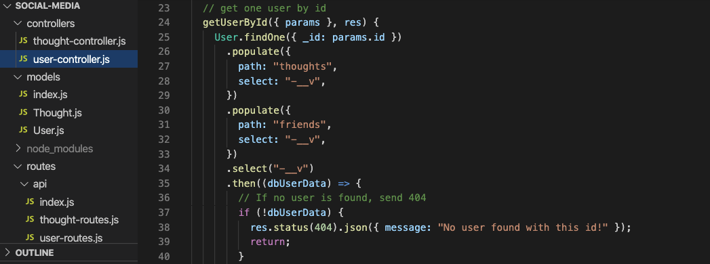
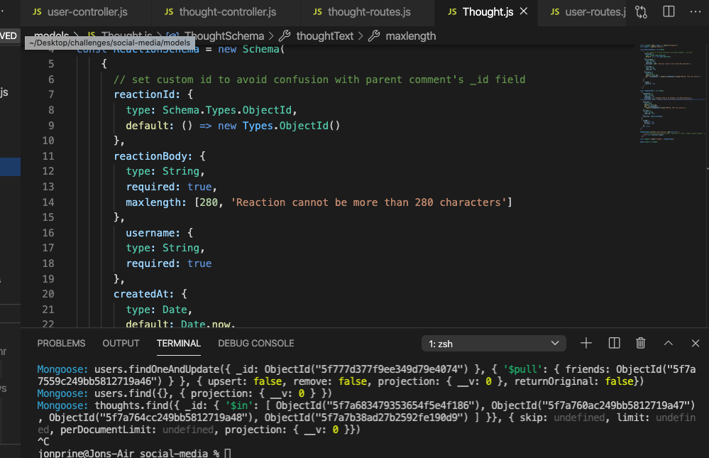
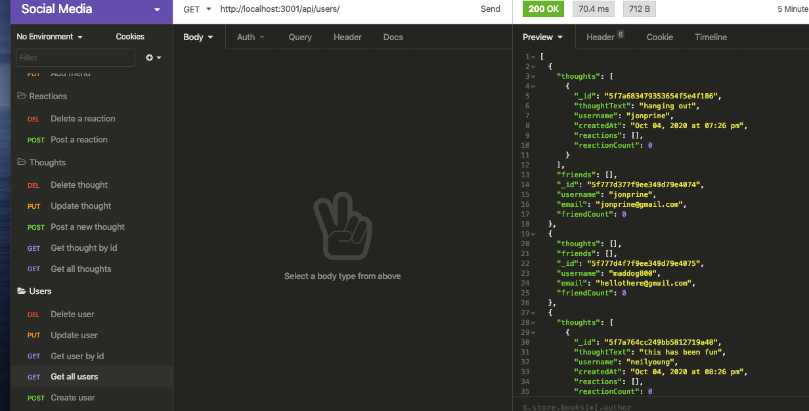
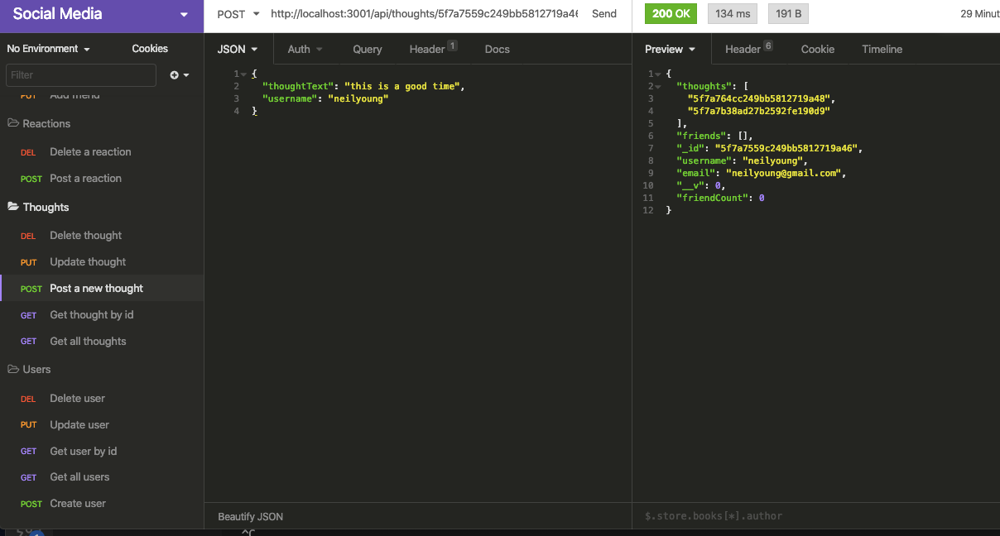

# Tech Blog

## Purpose
To create a social network api using MongoDB and Mongoose.

## Built With
* JavaScript
* Node
* Express
* MongoDB
* Mongoose

## Installation
install node packages express, mongoose. Use MongoDB.

## Contribution
Made by Jon Prine

## Screenshots of Finished Page

